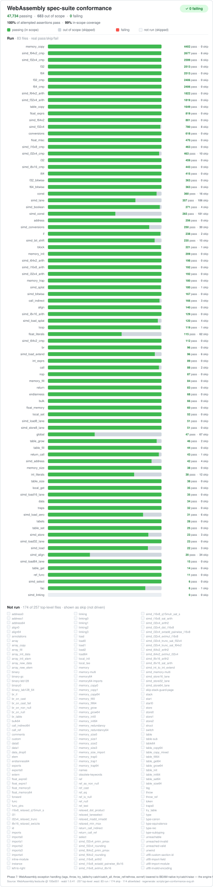

# carder
> this is a large experimental project. the mass majority of  the code was written by claude. no promises made. definitely don't use it in anything production as it's pretty slow right now (that will be fixed in the future)

carder is an attempt to compile WASM to run on the BEAM, where the output is Core Erlang. This isn't a WASM VM, rather, it's trying to actually "convert" the code as much as possible & optimise it for BEAM behaviour and functional programming concepts.

it works right now! kinda. a good amount of wasm will compile and run in the BEAM, with the supported WASM spec growing everyday. carder has its own IR, and as such supports multiple frontends. WASM is just the first. JS is in the works via [Porffor](https://github.com/CanadaHonk/porffor) (js -> wasm -> beam).

## why?

in theory since this is just going to Core Erlang, and can operate without any [NIF](https://www.erlang.org/doc/system/nif.html) usage, the code runs preemptively. this is also just fun. I've done a lot of reading over the past few months on compilers, and have many optimisation methods planned. 

## how?
`wasm -> ir -> core erlang -> beam`

the js path is `js -> wasm (via Porffor) -> ir -> core erlang -> beam` 

memory is a little messy right now. there are a number of modes the compiler can run in which changes how memory is allocated and accessed. throughout the code and the cli
you will see three modes referenced: (p, o, n). p = pure. runs anywhere. o = uses otp-specifics (atomics), n = custom nif (not built yet).

the custom nif will be the fastest, since it gives a full escape hatch to BEAM-fundamentals. but a) it's not as cool, b) it risks crashing the node.
ideally some optimisations i have planned will close the gap as much as possible. using o mode over p results in a 2-4x speedup right now.

## let me try it

there is a pretty big corpus of wasm files scattered across the code for testing if you don't have one to hand. for example,
give this a try:

```shell
$ gleam run -- run test/carder/conformance/corpus/add.wasm add 3 5
8
```

this command is the "all in one", it'll take the wasm, conver it to the ir, turn that into core erlang, then compile it to beam, then load that module and run it.
the WAT for this file is as follows:

```webassembly
;; add(i32,i32) — direct numeric op, params, export, end-to-end plumbing.
;; mul exercises i32 two's-complement WRAP through codegen (i32.mul is mod 2^32).
(module
  (func (export "add") (param i32 i32) (result i32)
    (i32.add (local.get 0) (local.get 1)))
  (func (export "mul") (param i32 i32) (result i32)
    (i32.mul (local.get 0) (local.get 1))))
```

(so we're calling the add export with params 3 and 5 for the two i32's)

you can also print out each stage of the pipeline. it's all modular. run `gleam run -- help` to see all the commands (e.g. dump the ir, dump the .core, just export to .beam)

## project status

the main thing right now is getting good WASM conformance, then focus on finding performance based on the ir & optimising.

<p align="center">
  
</p>

## contributing

building this burns a lot of tokens. i'd love help if you have some spare claude tokens and want to contribute! claude works out of the specs/ folder, and maintains a ledger of state and a standard workflow
for planning new phases. that's worked pretty well so far to get to where the project is now. that being said, I leave claude working on it 24/7, so rather than double-work, hit me up on Discord (@hiett) and we can allocate the workload so there's no overlap.

## license

carder is licensed under the [Apache License 2.0](LICENSE). you're free to use, modify, and distribute it — including in commercial and closed-source products — provided you keep the license and attribution notices intact. the Apache license also carries an explicit patent grant. see [LICENSE](LICENSE) and [NOTICE](NOTICE) for the full terms.
